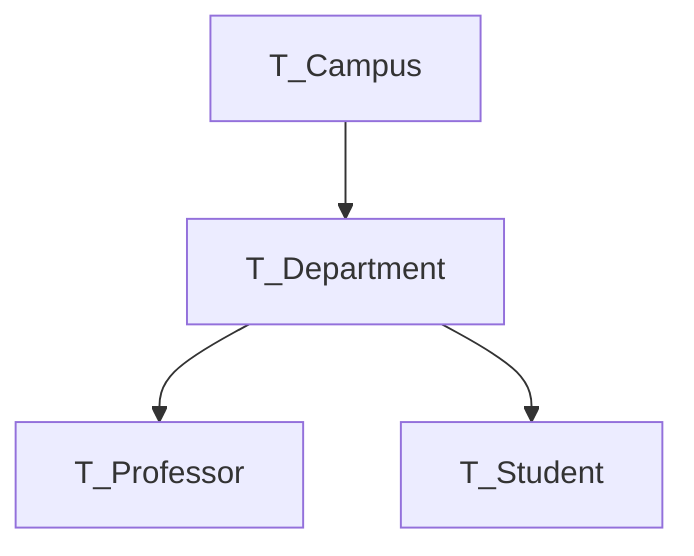

# DB Schema Export Tool

The DB Schema Export Tool exports SQL Server or PostgreSQL database objects as schema files.
Exported objects include tables, views, stored procedures, functions, and synonyms,
plus also database properties including database roles and logins.

Uses integrated authentication or a named user to connect to a Microsoft SQL Server database.

Uses a named user, password, and port to connect to a PostgreSQL database.

### Continuous Integration

The latest version of the application is available for one month on the [AppVeyor CI server](https://ci.appveyor.com/project/PNNLCompMassSpec/db-schema-export-tool/build/artifacts)

[](https://ci.appveyor.com/project/PNNLCompMassSpec/db-schema-export-tool)

## Features

In addition to creating schema files for tables, views, stored procedures, functions, and synonyms,
the program can also export table data to create SQL files with an Insert statement for each row.

The DB Schema Export Tool has both a command line interface and a GUI mode.
Starting the program without any parameters will show the GUI.

The command line interface is useful for automatically exporting schema files on a regular basis.
Example command (wrapped here for readability):

```
DB_Schema_Export_Tool.exe
  C:\Cached_DBSchema
  /Server:Proteinseqs
  /DBList:Manager_Control,Protein_Sequences
  /Sync:"F:\Projects\Database_Schema\DMS"
  /Git /Commit
  /L /LogDir:Logs
  /Data:ProteinSeqs_Data_Tables.txt
```

## Console switches

```
DB_Schema_Export_Tool.exe
 SchemaFileDirectory /Server:ServerName
 /DB:Database /DBList:CommaSeparatedDatabaseName
 [/DBUser:username] [/DBPass:password]
 [/PgUser:username] [/PgPass:password] [/PgPort:5432]
 [/DirectoryPrefix:PrefixText] [/NoSubdirectory] [/CreateDBDirectories]
 [/DataTables:TableDataToExport.txt] [/Map:ColumnMapping.txt]
 [/DataSort:PgDumpTableDataSortOrder.txt]
 [/TableFilterList] [/SchemaSkipList]
 [/ColumnFilter:FileName] [/DateFilter:FileName]
 [/NameFilter:FilterSpec]
 [/DataExportOrder:FileName]
 [/Schema:SchemaName] [/ExistingDDL:SchemaFileName]
 [/NoAutoData] [/ExportAllData] [/MaxRows:1000] [/NoData]
 [/DisableStatementLogging:true] [/MinLogDuration:5000]
 [/DeleteExtraRows] [/ForceTruncate:TableList]
 [/DisableTriggers] 
 [/ScriptLoad] [/ScriptUser:username] [/ScriptDB:Database] 
 [/ScriptHost:HostName] [/ScriptPort:Port]
 [/SnakeCase] [/PgDump] [/KeepPgDumpFile]
 [/PgInsert] [/PgInsertChunkSize:50000]
 [/ServerInfo] [/NoSchema]
 [/Sync:TargetDirectoryPath] [/Git] [/Svn] [/Hg] [/Commit]
 [/L] [/LogFile:BaseName] [/LogDir:LogDirectoryPath]
 [/Preview] [/Stats] [/Trace]
 [/ParamFile:ParamFileName.conf] [/CreateParamFile]
```

`SchemaFileDirectory` is the path to the directory where the schema files will be saved (aka the output directory)
* Optionally use named parameter `/OutputDir:DirectoryPath`

To process a single database, use `/Server` and `/DB`
* The server is assumed to be Microsoft SQL Server
* However, if `/PgUser` is provided (or `PgUser` is defined in the parameter file), will treat as a PostgreSQL server

Use `/DBList` to process several databases (separate names with commas)

Use `/DBUser` and `/DBPass` to specify a username and password for connecting to a SQL Server instance
* If not defined, will use Windows Integrated Authentication

Use `/PgUser` to define the username to use to connect to a PostgreSQL database

Use `/PgPass` to define the password for the PostgreSQL user
* As described below, you can create a file named `pgpass.conf` at `%APPDATA%\postgresql` to track passwords for PostgreSQL users
* The format is `server:port:database:username:password`
* `pg_dump.exe` will obtain the password from this file if it exists
* On Linux, the file is stored at `~/.pgpass`

Use `/PgPort` to specify the port to use for PostgreSQL
* Defaults to 5432

By default, a subdirectory named DBSchema__DatabaseName will be created below `SchemaFileDirectory/`
* Customize this prefix text using `/DirectoryPrefix`

Use `/NoSubdirectory` to disable auto creating a subdirectory for the database being exported
* Note: subdirectories will always be created if you use `/DBList` and specify more than one database

Use `/CreateDBDirectories:False` to disable creating a subdirectory for the schema files for each database

Use `/DataTables` or `/Data` to define a text file with table names (one name per line) for which the data
should be exported. In addition to table names defined in `/Data`, there are default tables
which will have their data exported; disable the defaults using `/NoAutoData`
* Also supports a multi-column, tab-delimited format
  * Put `<skip>` in the TargetTableName column to indicate that the table should not be included when using `/ExportAllData`
* The file can also track renamed views
* File format

| SourceTableName        | TargetSchemaName | TargetTableName       | PgInsert  | KeyColumn(s)      |
|------------------------|------------------|-----------------------|-----------|-------------------|
| T_Analysis_State_Name  | public           | t_analysis_job_state  | true      | job_state_id      |
| T_DatasetRatingName    | public           | t_dataset_rating_name | true      | dataset_rating_id |
| T_Log_Entries          | public           | t_log_entries         | false     |                   |
| T_Job_Events           | cap              | t_job_Events          | false     |                   |
| T_Job_State_Name       | cap              | t_job_state_name      | true      | job               |
| T_Users                | public           | t_users               | true      | user_id           |
| x_T_MgrState           | public           | `<skip>`              |           |                   |
| V_Cell_Culture         | public           | v_biomaterial         |           |                   |
| V_Cell_Culture_Date    | public           | v_biomaterial_date    |           |                   |


Tables with `PgInsert` set to true will have data insert commands formatted as PostgreSQL compatible
`INSERT INTO` statements using the `ON CONFLICT (key_column) DO UPDATE SET` syntax
* This is only applicable when exporting data from SQL Server
* Use the `KeyColumn(s)` column to specify the primary key (or pair of unique keys) used for determining a conflict
  * Any columns that are not key columns will be updated when a conflict is found
  * If `PgInsert` is true, but the `KeyColumn(s)` column is empty, the program will look for an identity column on the source table
* Example generated SQL:

```PLpgSQL
INSERT INTO mc.t_mgr_types (mt_type_id, mt_type_name, mt_active)
OVERRIDING SYSTEM VALUE
VALUES
  (1, 'Analysis', 1),
  (2, 'Archive', 0),
  (3, 'Archive Verify', 0),
  (4, 'Capture', 1),
  (5, 'Space', 1),
  (6, 'Data Import', 1)
ON CONFLICT (mt_type_id)
DO UPDATE SET
  mt_type_name = EXCLUDED.mt_type_name,
  mt_active = EXCLUDED.mt_active;

-- Set the sequence's current value to the maximum current ID
SELECT setval('mc.t_mgr_types_mt_type_id_seq', (SELECT MAX(mt_type_id) FROM mc.t_mgr_types));

-- View the current ID for the sequence
SELECT currval('mc.t_mgr_types_mt_type_id_seq');
```

Use `/Map` or `/ColumnMap` to define a tab-delimited text file mapping source column names to target column names, by table
* Use keyword `<skip>` in the `TargetColumnName` column to indicate that a source column should not be included in the output file
* If `/SnakeCase` is used to auto-change column names, mappings in this file will override the snake case auto-conversion
* File format:

| SourceTableName  | SourceColumnName | TargetColumnName |
|------------------|------------------|------------------|
| T_Analysis_Job   | AJ_jobID         | job              |
| T_Analysis_Job   | AJ_start         | start            |
| T_Analysis_Job   | AJ_finish        | finish           |
| t_users          | name_with_prn    | `<skip>`         |


Use `/DataSort` (or `/PgDumpDataSort` or `/PgDumpTableDataSortOrder`) to define a tab-delimited text file that defines the columns to use for sorting data exported using PgDump
* The export file will be re-written with data sorted by the specified column numbers (1-based)
* Table names should include the schema, e.g. "public.t_event_target" or "sw.t_job_state_name"
* Sort_Columns should list the column number (or comma-separated list of column numbers) to sort the data on
  * "1" means to sort using the first column
  * "2, 3" means to sort using the second column, then the third column
* Values in Sort_Numeric should be True, False, or an empty string
  * True means to assume the data in the first sort column is numeric (integer or double)
  * False is ignored; if any sort column has numbers for every row, it will be sorted as numeric
* File format:

| Table_Name                           | Sort_Columns   | Sort_Numeric |
|--------------------------------------|----------------|--------------|
| cap.t_automatic_jobs                 | 1, 2           |              |
| cap.t_scripts                        | 2              |              |
| cap.t_scripts_history                | 3, 1           |              |
| cap.t_step_tools                     | 2, 1           |              |
| cap.t_task_state_name                | 1              | True         |
| public.t_analysis_job_state          | 1              | True         |
| public.t_default_psm_job_parameters  | 2, 3, 4, 5, 6  |              |
| public.t_user_operations_permissions | 1, 2           | True         |
| sw.t_job_state_name                  | 1              | True         |
| timetable.task                       | 2, 1           | True         |
                       
Use `/TableFilterList` or `/TableNameFilter` to specify a table name (or comma separated list of names) to restrict table export operations
* This is useful for exporting the data from just a single table (or a few tables)
* This parameter does not support reading names from a file; it only supports actual table names
* If a file was defined via the `/DataTables` parameter, the list of tables loaded from that file will be filtered by this list (matching both SourceTableName and TargetTableName)

Use `/SchemaSkipList` to specify a schema name (or comma separated list of names) of schema to skip
* This is useful if using partitioned tables

Use `/ColumnFilter` or `/TableDataColumnFilter` to define a tab-delimited text file that defines columns to skip when exporting data from tables
* The program auto-skips computed columns and timestamp columns when exporting data as PostgreSQL compatible INSERT INTO statements
* File format:

| Table                  | Column           | Comment                                                                        |
|------------------------|------------------|--------------------------------------------------------------------------------|
| T_Cached_Dataset_Links | DS_RowVersion    | In PostgreSQL, tracked via data type xid; comes from t_dataset.xmin            |
| T_Cached_Dataset_Links | SPath_RowVersion | In PostgreSQL, tracked via data type xid; comes from t_storage_path.xmin       |
| T_EUS_Proposals        | Numeric_ID       | Computed column (redundant here since the program auto-skips computed columns) |


Use `/DateFilter` or `/TableDataDateFilter` to define a tab-delimited text file that defines date filters to use when exporting data from tables
* The data file will include the start date in the name, for example: `mc.t_log_entries_Data_Since_2020-01-01.sql`
* File format:

| SourceTableName          | DateColumnName   | MinimumDate  |
|--------------------------|------------------|--------------|
| T_Event_Log              | Entered          | 2020-01-01   |
| T_Log_Entries            | posting_time     | 2020-01-01   |
| T_ParamValue             | last_affected    | 2020-01-01   |
| T_ParamValue_OldManagers | last_affected    | 2016-01-07   |


Use `/NameFilter` to define a filter to apply to exported tables, views, procedures, etc.
* Will only export objects that contain this text in the name
  * This is only applicable when exporting objects from SQL Server
* Use `^` to indicate the object names must start with the text, for example `^Auto` to start with Auto
  * This only works if using a parameter file, since the Windows command line parser removes ^
* Use `$` to indicate the object names must end with the text, for example `Report$` to end with Report
* Other RegEx qualifiers are supported; matches are case insensitive
* Multiple filters can be provided by separating with commas
  * At the command line, surround comma separated lists with double quotes
  * Will not split on commas if the object name filter has square brackets

Use `/DataExportOrder` to define a text file with table names (one name per line) defining the order that data should be exported from tables
* Should have table names only, without schema
* Tables not listed in this file will have their data exported alphabetically by table name
* If the first line is Table_Name, will assume that it is a header line (and will thus ignore it)
* If `/ScriptLoad` is used to create a shell script for loading data (see below), the data will be loaded in the order specified by the `DataExportOrder` file, followed by tables not listed in the file
  * This is useful for assuring that data is loaded into the database in an order that will guarantee that foreign keys are valid
* For example, given a multi-campus university that tracks graduate students and professors using four tables:


the `DataExportOrder` file should have the following:
```
T_Campus
T_Department
T_Professor
T_Student
```
* Loading data in this order assures that when the department data is loaded, the Campus\_ID for each department will refer to an existing row in the campus table
* Next, when the professor and student data is loaded, the Department\_ID for each person will refer to an existing row in the department table

Use `/Schema` or `/DefaultSchema` to define the default schema name to use when exporting data from tables
* Entries in the `/DataTables` file will override this default schema

Use `/ExistingDDL` or `/ExistingSchema` to define a text file that should be parsed to rename columns, based on data loaded from the `/ColumnMap` file
* Will create a new text file with CREATE TABLE blocks that include the new column names
  * Will skip columns with `<skip>`
* Will skip tables (and views, procedures, etc.) that are defined in the `/DataTables` file but have `<skip>` in the TargetTableName column
  * Does not rename tables

Use `/ExportAllData` or `/ExportAllTables` to export data from every table in the database
* Will skip tables (and views) that are defined in the `/DataTables` file but have `<skip>` in the TargetTableName column
* Ignored if `/NoTableData` is true

Use `/MaxRows` to define the maximum number of data rows to export
* Defaults to 1000
* Use 0 to export all rows
* If you use `/ExportAllData` but do not specify `/MaxRows`, the program will auto set `/MaxRows` to 0

Use `/NoTableData` or `/NoData` to prevent any table data from being exported
* This parameter is useful when processing an existing DDL file with `/ExistingDDL`

By default, the table data load script will update the PostgreSQL system settings to set `log_min_duration_statement` to -1, which will disable logging statements that execute longer than a given threshold
* If your system has `log_min_duration_statement` defined, and if the insert queries take longer than the threshold, the entire insert query (including all of the data values) will be written to the log file
  * If you are importing a large amount of data, this could lead to very large PostgreSQL log file sizes
* By using `/DisableStatementLogging:True` (the default) you avoid the possibility of long-running `INSERT INTO` queries bloating up the log files
  * The database user must be a superuser to update the `log_min_duration_statement` system setting, since that setting affects all current and future connections in all databases on the server
* After importing all of the data, the script will set `log_min_duration_statement` to 5000 (meaning to log statements that run longer than 5 seconds)
  * This can be customized using `/MinLogDuration` (or `MinLogDurationAfterLoad=` in a parameter file)
* Use `/DisableStatementLogging:False` to disabling adjusting the value of `log_min_duration_statement`

Use `/MinLogDuration` to customize the value to set `log_min_duration_statement` to once all of the data has been imported
* The default is `/MinLogDuration:5000`

Use `/DeleteExtraRows` to create files with commands to delete extra rows in database tables (provided the table has one or more primary keys)
* If `/ScriptLoad` is enabled (or the parameter file has `ScriptLoad=True`), the shell script will use these files to delete extra rows prior to importing new data
* If `/DataExportOrder` was used to specify the export order for table data, the shell script will delete extra rows from tables in the reverse order from that defined in the `DataExportOrder` file
  * The logic for this is that the purpose of the `DataExportOrder` file is to assure that 

* If a table has a single-column primary key, the delete queries will be of the form:
```PLpgSQL
DELETE FROM "t_user_status" target
WHERE status BETWEEN 'Active' AND 'Obsolete' AND
      NOT EXISTS ( SELECT S.status
                   FROM "t_user_status" S
                   WHERE target.status = S.status AND
                         S.status in (
'Active','Inactive','Obsolete'
                         )
                  );
```

* If a table has a multi-column based primary key, the delete queries will be of the form:
```PLpgSQL
DELETE FROM t_internal_std_composition target
WHERE target.component_id BETWEEN 10 AND 72 AND
      NOT EXISTS ( SELECT S.component_id
                         ,S.mix_id
                   FROM t_internal_std_composition S
                   WHERE target.component_id = S.component_id AND
                         target.mix_id = S.mix_id AND
                         (
S.component_id = 10 AND S.mix_id = 1 OR
S.component_id = 10 AND S.mix_id = 3 OR
S.component_id = 11 AND S.mix_id = 1 OR
S.component_id = 11 AND S.mix_id = 3 OR
S.component_id = 13 AND S.mix_id = 1 OR
S.component_id = 13 AND S.mix_id = 3 OR
S.component_id = 21 AND S.mix_id = 5 OR
S.component_id = 22 AND S.mix_id = 5
                         )
                  );
```

Use `/ForceTruncate` to specify a table name (or comma separated list of names) that have a primary key, but you would rather truncate the table data instead of using either of the `DELETE FROM` queries shown above
* This is useful for large tables where the `DELETE FROM` queries run very slowly
* Names in this list can match either source table names or target table names
* Ignored if `/DeleteExtraRows` is false

Use `/DisableTriggers` (or `/IncludeDisableTriggerCommands`) to include trigger disable / enable commands in data export files
* Ignored if `PgInsert` is true since `session_replication_role` is set to "replica" prior to inserting/deleting data

Use `/ScriptLoad` or `/Script` to create a bash script file for loading exported table data into a PostgreSQL database

Use `/ScriptUser` to define the username to use when calling `psql` in the bash script
* If not defined, will use the username being used to run the DB Schema Export Tool

Use `/ScriptDB` to define the target database name to use when calling `psql` in the bash script
* The default is `/ScriptDB:dms`

Use `/ScriptHost` to define the host name to use when calling `psql` in the bash script
* The default is `/ScriptHost:localhost`

Use `/ScriptPort` to define the port name to use when calling `psql` in the bash script
* The default is `/ScriptPort:5432`
* The port number will only be included in the bash script if it is not the default

Use `/SnakeCase` to auto change column names from Upper\_Case and UpperCase to lower_case when exporting data from tables
* Also used for table names when exporting data from tables
* Entries in the `/DataTables` and `/ColumnMap` files will override auto-generated snake_case names

Use `/PgDump` or `/PgDumpData` to specify that exported data should use `COPY` commands instead of `INSERT INTO` statements
* With SQL Server databases, table data will be exported using pg_dump compatible COPY commands when `/PgDump` is used
* With PostgreSQL data, table data will be exported using the pg_dump application
* With SQL Server data and PostgreSQL data, if `/PgDump` is not provided, data is exported with `INSERT INTO` statements
* With SQL Server data, if `/PgDump` is provided, but the `/DataTables` file has `true` in the `PgInsert` column, `INSERT INTO` statements will be used for that table

Use `/KeepPgDumpFile` to not delete the `_AllObjects_.sql` created for each database
* By default, this is false, meaning the `_AllObjects_.sql` file will be deleted (since it is no longer needed because a separate .sql file has been created for each object)
** If any unhandled scripting commands are encountered, the `_AllObjects_.sql` file will not be deleted, even if KeepPgDumpFile is false
* In addition, when this is true, store the original PgDump table data files in directory `Replaced_PgDump_Files`

The `/PgInsert` applies when exporting data from SQL Server database tables
* While reading the TableDataToExport.txt file, default the PgInsert column to true when `/PgInsert` is provided, meaning table data will be exported via INSERT INTO statements, as mentioned above
* Ignored for PostgreSQL data

Use `PgInsertChunkSize` to specify the number of values to insert at a time when PgInsert is true for a table
* Only applicable when exporting data from SQL Server

Use `/ServerInfo` to export server settings, logins, and SQL Server Agent jobs

Use `/NoSchema` to skip exporting schema (tables, views, functions, etc.)

Use `/Sync` to copy new/changed files from the output directory to an alternative directory
* This is advantageous to prevent file timestamps from getting updated every time the schema is exported

Use `/Git` to auto-update any new or changed files using Git

Use `/Svn` to auto-update any new or changed files using Subversion

Use `/Hg`  to auto-update any new or changed files using Mercurial

Use `/Commit` to commit any updates to the repository

Use `/L` to log messages to a file

Use `/LogFile` to specify the base name for the log file
* Log files will be named using the base name, followed by the current date

Use `/LogDir` or `/LogDirectory` to specify the directory to save the log file in
* By default, the log file is created in the current working directory

Use `/Preview` to count the number of database objects that would be exported

Use `/Stats` to show (but not log) export stats

Use `/Trace` to show additional debug messages at the console

The processing options can be specified in a parameter file using `/ParamFile:Options.conf` or `/Conf:Options.conf` or `/P:Options.conf`
* Define options using the format `ArgumentName=Value`
* Lines starting with `#` or `;` will be treated as comments
* Additional arguments on the command line can supplement or override the arguments in the parameter file

Use `/CreateParamFile` to create an example parameter file
* By default, the example parameter file content is shown at the console
* To create a file named Options.conf, use `/CreateParamFile:Options.conf`

## Software Dependencies

This program leverages the SQL Server Management Objects (SMO) Framework
* All of the required DLLs should be included in the DBSchemaExportTool .zip file

In order to use the `/Git,` `/Svn,` or `/Hg` switches, you need the following software installed
and the executables present at a specific location:

Git
* `C:\Program Files\Git\bin\git.exe`
* Installed with 64-bit Git for Windows, available at https://git-scm.com/download/win

Subversion:
* `C:\Program Files\TortoiseSVN\bin\svn.exe`
* Installed with 64-bit Tortoise SVN, available at https://tortoisesvn.net/downloads.html

Mercurial
* `C:\Program Files\TortoiseHg\hg.exe`
* Installed with 64-bit Tortoise Hg,  available at https://tortoisehg.bitbucket.io/download/index.html

### PostgreSQL

Schema export from PostgreSQL databases utilizes the pg_dump utility
* `pg_dump.exe` is available as part of the PostgreSQL for Windows installer from the EDB website
  * https://www.enterprisedb.com/downloads/postgres-postgresql-downloads
* Run the installer
  * De-select installing PostgreSQL Server
* Copy `pg_dump.exe` plus several DLLs from `C:\Program Files\PostgreSQL\16\bin` to the directory with the DB_Schema_Export_Tool executable
  * See batch file `Copy_pg_dump_files.bat`

File `pgpass.conf` at `%APPDATA%\postgresql` can be used to store the password for the PostgreSQL user
* On Linux, the file is stored at `~/.pgpass`

```
mkdir %APPDATA%\postgresql
echo prismweb3:5432:dms:dmsreader:dmspasswordhere > %APPDATA%\postgresql\pgpass.conf
```

Example call to pg_dump:
```
pg_dump.exe -h prismweb3 -p 5432 -U dmsreader -d dms --schema-only --format=p --file=_AllObjects_.sql
```

Note that on Windows the .sql file created by `pg_dump.exe` includes extra carriage returns, resulting in `CR CR LF` instead of `CR LF`
* DB_Schema_Export_Tool.exe removes the extra carriage returns while parsing the SQL dump file

## Contacts

Written by Matthew Monroe for the Department of Energy (PNNL, Richland, WA) \
E-mail: matthew.monroe@pnnl.gov or proteomics@pnnl.gov\
Website: https://github.com/PNNL-Comp-Mass-Spec/ or https://www.pnnl.gov/integrative-omics
Source code: https://github.com/PNNL-Comp-Mass-Spec/DB-Schema-Export-Tool

## License

The DB Schema Export Tool is licensed under the 2-Clause BSD License;
you may not use this program except in compliance with the License.  You may obtain
a copy of the License at https://opensource.org/licenses/BSD-2-Clause

Copyright 2019 Battelle Memorial Institute
